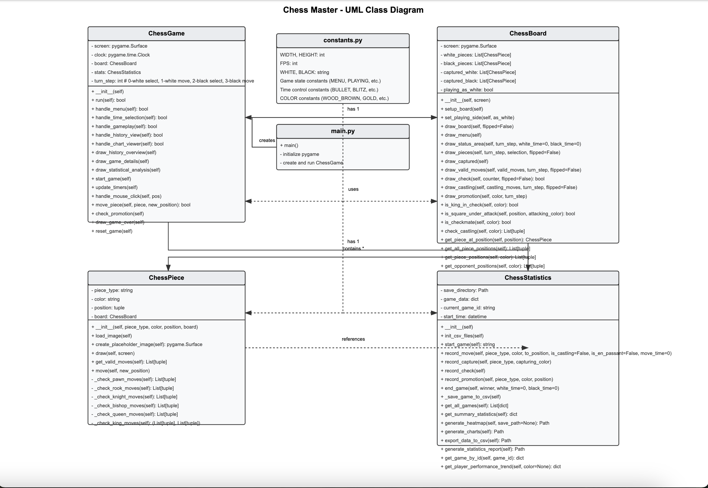

# Chess Master

## Overview
Chess Master is a fully-featured chess game built with Pygame that offers a complete chess experience with multiple game modes, statistics tracking, and visualization. The game implements all standard chess rules including special moves like castling, en passant, and pawn promotion.

## Concept
The concept behind Chess Master is to provide an engaging chess experience that not only allows users to play the game but also to analyze their performance over time. By tracking game statistics and generating visualizations, players can gain insights into their playing patterns and improve their skills.

## Key Features
- Complete chess rules implementation
- Multiple time controls (Bullet, Blitz, Rapid, Classical)
- Game statistics tracking and visualization
- Performance analysis with charts and heatmaps
- Play as white or black
- Board flipping
- Visual move highlighting and check indicators
- Captured pieces display

## UML Class Diagram

## Data Component
The data component of Chess Master includes comprehensive game statistics tracking and visualization:
- Win rates and game duration analysis
- Piece usage statistics
- Move patterns and heatmaps
- Performance trends over time

## YouTube Presentation
[Chess Master Project Presentation](https://www.youtube.com/watch?v=XXXXXXXXXXX)